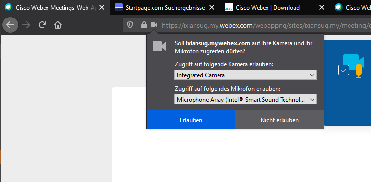

# Joining the Webex Meeting

- Follow the Link: [https://ixiansug.my.webex.com/ixiansug.my/j.php?MTID=m0e9c40d5be52cc4224870ee1c60d3ca5](https://ixiansug.my.webex.com/ixiansug.my/j.php?MTID=m0e9c40d5be52cc4224870ee1c60d3ca5)
- You should get prompted to download the desktop app. It is **highly recommended to use the desktop app** as it offers more features (such as screen sharing in breakout room).
- If no prompt comes, visit [https://www.webex.com/downloads.html](https://www.webex.com/downloads.html)
    - Desktop app is only available for Windows and macOS
    - Linux, BSD, ... users please use the WebApp.
- If you can't use the desktop app: just join through your Web-Browser! (Recommended: Chrome/Chromium) 

(German for "Join with your Browser")

- In case this doesn't show up, wait a few seconds, try different Browsers and incognito-mode

- When joining through the Web Browser grant access to your Microphone (and Camera)

# Meeting Window

- During the lectures we will present a PowerPoint 
- You can ask questions in the Chat in the bottom right
    - They will be answered after a lecture ends or during Q&A

# Breakout Rooms

- During the exercises you will work together in small groups in the breakout rooms
- When the exercise starts you will be prompted to move to a assigned breakout room

- Please assign one Person who will share their screen and solve the exercise together
- You can share your screen by clicking on `Share`

- Please share the Application the Jupyter Lab Exercises are running in

- If you're stuck, you can **ask for help** in the upper right corner. We will then join your group and help you out!

- 5 Minutes before the exercise ends you will get notified
- After the 5 Minutes you will return to the Main Session, where the next lecture will take place

- If you disconnect or accidentally leave the breakout room you can rejoin it by clicking on the "Join" button in the upper right corner

# Troubleshooting

- In case the link won't work for you these are the meeting credentials:
    - Meeting ID: 163 964 9511
    - Meeting Password: JvJxXMHR426

- Windows: if your Audio and Camera aren't working. Please open your Windows Settings (Windows-Key + I) and head over to Privacy (dt: Datenschutz) > Microphone. And check if the **Allow apps to access your camera** field is checked. (Same for camera)
- You may need to restart the Cisco Meetings App afterwards
